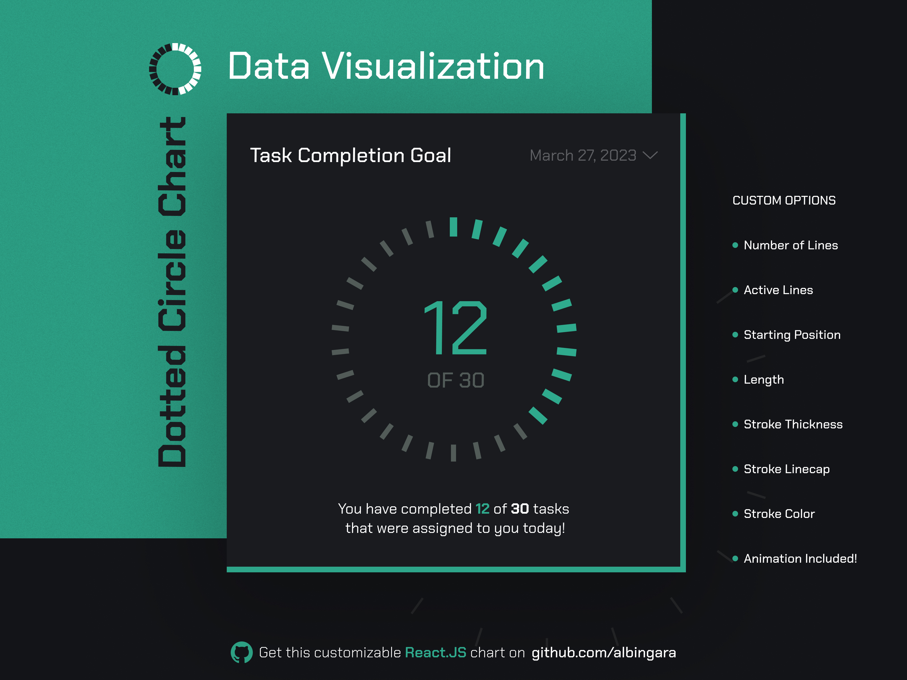

# Dotted Circle

A React.js application featuring a dynamic dotted circle with customizable animations and interactive controls.



## Features

- Dynamic number of dots/lines
- Smooth animations
- Interactive control panel
- Responsive design
- Built with React and Vite

## Getting Started

### Prerequisites

- Node.js (version 14 or higher)
- npm or yarn

### Installation

1. Clone the repository
2. Install dependencies:
   ```bash
   npm install
   ```

3. Start the development server:
   ```bash
   npm run dev
   ```

4. Open your browser and navigate to `http://localhost:5173`

### Available Scripts

- `npm run dev` - Start development server
- `npm run build` - Build for production
- `npm run preview` - Preview production build

## Technologies Used

- React 18
- Vite
- Sass/SCSS
- Prop Types

## License

This project is licensed under the MIT License.
